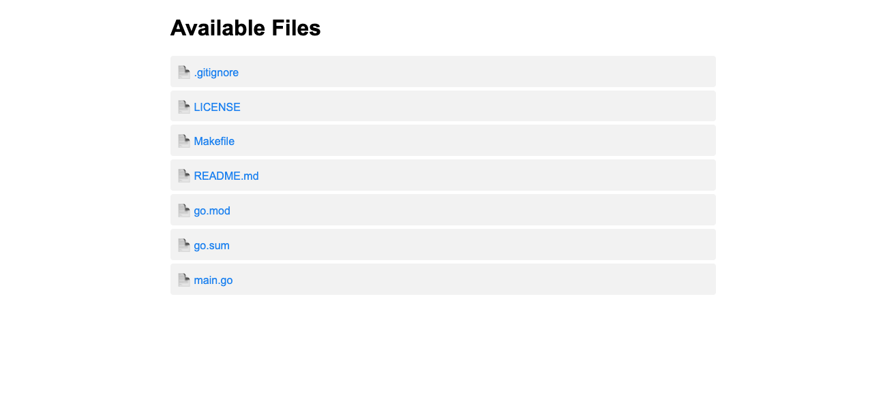

[](https://github.com/deepraj02/snoop)

# Snoop : Share files easily.
Snoop is a CLI tool created with golang using cobra, which helps in transfering files among devices that are connected to the same network.

## Table of Contents
- [Local Development Setup](#local-development-setup)
- [Installation](#installation)
- [How to Use](#how-to-use)
- [File and Directory Information](#file-and-directory-information)
- [License](#license)

## Local Development Setup

To set up the project for local development, follow these steps:

1. **Clone the repository:**
    ```sh
    git clone https://github.com/deepraj02/snoop.git
    cd snoop
    ```

2. **Install dependencies:**
    Ensure you have Go installed. Then, run:
    ```sh
    go mod download
    ```

3. **Build the project:**
    ```sh
    make build
    ```

4. **Run the project:**
    ```sh
    make run
    ```

## Installation
> **Note:** Working on releasing the binary directly to package repos like Choco (windows), apt-get (Linux), as of now for these platform you can download the zip/tar.gz files.

As for Mac users you can directly install it via **Homebrew**

```sh
brew tap deepraj02/taps
```
then 

```sh
brew install snoop
```

**OR**

```sh
brew install deepraj02/taps/snoop
```

## How to Use


1. **Navigate to the directory you want to share:**
    ```sh
    cd /path/to/your/directory
    ```

2. **Start the server:**
    ```sh
    snoop serve
    ```

    By default, the server will start on port 8080. You can specify a different port using the `-p` or `--port` flag:
    ```sh
    snoop serve -p 9090
    ```

3. **Access the server:**
    Open your web browser and navigate to [http://your-local-ip:8080]() (or the port you specified).

4. **Download files:**
    Click on the file links to download them.


